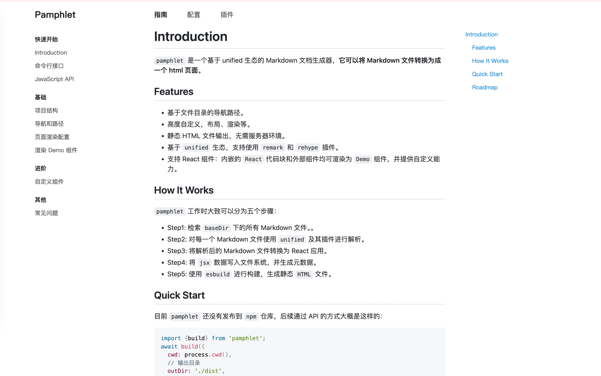

# Pamphlet

[](https://github.com/huk10/pamphlet/blob/master/LICENSE)


[](https://github.com/huk10/pamphlet/releases)

一个基于 unified 生态的 Markdown 文档生成器，**它可以将 Markdown 文件转换为成一个 html 页面**。

这是部署到 GitHub Pages 的文档地址：[pamphlet](https://huk10.github.io/pamphlet/)

效果图：



## Features

- 基于文件目录的导航路径。
- 高度自定义，布局、渲染等。
- 静态 HTML 文件输出，无需服务器环境。
- 基于 `unified` 生态，支持使用 `remark` 和 `rehype` 插件。
- 支持 React 组件：内嵌的 `React` 代码块和外部组件均可渲染为 `Demo` 组件，并提供自定义能力。

## Quick Start

目前 `pamphlet` 还没有发布到 `npm` 仓库，后续通过 API 的方式大概是这样的：

```javascript
import {build} from 'pamphlet';
await build({
  cwd: process.cwd(),
  // 输出目录
  outDir: './dist',
  // 文档根目录
  baseDir: './docs',
  // 中间文件存放目录
  cacheDir: './.cache',
  // 首页文件路径
  entity: './docs/index.md',
  // esbuild options
  esbuild: {
    tsconfig: './tsconfig.build.json',
  },
  // 默认布局组件参数
  layoutProps: {
    // 项目名称。
    project: 'Pamphlet',
  },
});
```

## How It Works

`pamphlet` 工作时大致可以分为五个步骤：

- Step1: 检索 `baseDir` 下的所有 Markdown 文件。。
- Step2: 对每一个 Markdown 文件使用 `unified` 及其插件进行解析。
- Step3: 将解析后的 Markdown 文件转换为 React 应用。
- Step4: 将 `jsx` 数据写入文件系统，并生成元数据。
- Step5: 使用 `esbuild` 进行构建，生成静态 `HTML` 文件。

## Roadmap

- [ ] 优化默认页面布局样式。
- [ ] 支持内嵌 `React` 组件和代码块直接渲染（目前会包装到 `Demo` 组件中渲染）。
- [ ] 支持添加外部 JS、CSS 等资源到 HTML。
- [ ] 添加 CLI 命令，支持配置文件。
- [ ] 路由导航支持配置文件配置。
- [ ] 内置部分插件，如 数学公式。
- [ ] 产物体积优化。目前 JS 体积约为 1.2MB。
- [ ] 添加单元测试。
- [ ] 支持多语言文档。
- [ ] 支持多版本文档。
- [ ] 自定义路由和导航。
- [ ] 监视模式，支持文件变化自动构建。
- [ ] 自定义 Markdown 渲染主题（目前使用 GitHub 的白色样式）。
- [ ] 完善并暴露更多的配置项，如：`.md` 文件检索方式、 `esbuild` 的配置等。

## License

The [MIT License](./LICENSE).
